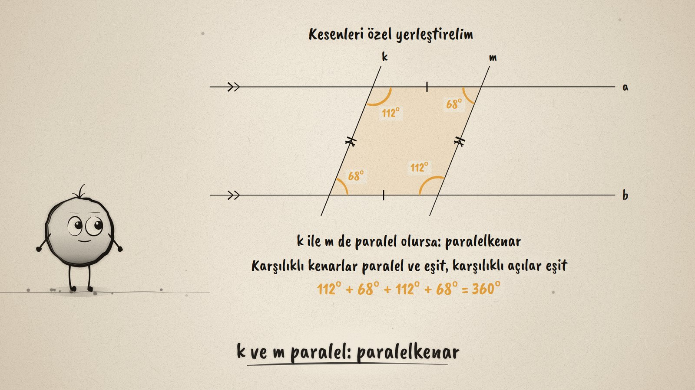
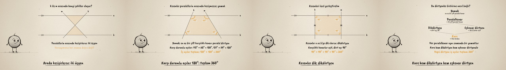

# İki Kesen · Two Transversals and Quadrilaterals

**▶ Tarayıcıda izleyin / Watch in the browser:** https://hakanatas.github.io/iki-kesen/ 
**⬇ MP4 + altyazılar / MP4 + subtitles:** [Releases](https://github.com/hakanatas/iki-kesen/releases) 
**✎ Kullanılan istem / The prompt behind it:** [PROMPT.md](PROMPT.md) 
**🎞 Bütün filmler / All films:** [Nokta'nın Filmleri](https://hakanatas.github.io/nokta-filmleri/?sinif=6)

> **TR —** 6. sınıf matematik "Geometrik Şekiller" temasındaki MAT.6.3.2 öğrenme çıktısı için hazırlanmış, tamamen JavaScript ile çizilen 92 saniyelik mürekkep animasyonu. a ve b paralel doğrularını k ve m kesenleri kesiyor. Önce bir varsayım: arada hep bir dörtgen oluşur. Kesenler kaydırılınca varsayım sınanıyor: a üzerinde kesişirlerse üçgen, paralellerin arasında kesişirlerse iki üçgen oluşuyor. Kesişmezlerse yamuk: karşı durumlu açıların toplamı 180°, iç açılar toplamı 360°. Üçgende alttaki açılar iç ters açılar olarak tepeye taşınıyor ve düz açıyı tamamlıyor: toplam 180°. Sonra kesenler özel yerleştiriliyor ve açılar canlı güncelleniyor: paralelkenar, dikdörtgen, eşkenar dörtgen, kare. Son olarak dörtgenler bir aile ağacında sınıflandırılıyor: her adımda bir özellik ekleniyor; her paralelkenar bir yamuk, kare hem dikdörtgen hem eşkenar dörtgen. Altyazılar Türkçe, İngilizce ya da ikisi birlikte seçilebilir.

A 92-second ink animation for **6th-grade maths**, the second film of the third 6th-grade theme. Nokta, the ink character from [The Learning Ink](https://github.com/hakanatas/the-learning-ink), is the guide again. Every shape is four numbers, where k and m meet lines a and b (`SH` in `src/draw/film.js`); the film eases between them, and the corner angles are measured from the drawing itself, with A + D and B + C kept at exactly 180° so the four always add up to 360°.

## Learning outcome

MEB, Türkiye Yüzyılı Maarif Modeli, Ortaokul Matematik, 6th grade, "Geometrik Şekiller" theme:

**MAT.6.3.2. Matematiksel araç ve teknolojiden yararlanarak iki paralel doğrunun iki kesenle oluşturduğu şekillerin özelliklerine dair çıkarım yapabilme**
- a) Düzlemde iki paralel doğrunun iki kesenle oluşturduğu şekillerin özelliklerine dair varsayımda bulunur.
- b) Oluşan şekilleri çeşitli özelliklerine göre listeler.
- c) Oluşan şekilleri kenar ve açı özelliklerini dikkate alarak varsayımları ile karşılaştırır.
- ç) Oluşan şekillerin iç açılarının ölçüleri toplamına ve yamuk, paralelkenar, eşkenar dörtgen, dikdörtgen, karenin ortak özelliklerine dair önermeler sunar.
- d) Sunduğu önermelerin dörtgenlerin sınıflandırılmasına yönelik katkısını değerlendirir.

## Scenes

| # | Time | Scene | What happens | Outcome |
|---|---|---|---|---|
| 1 | 0–10 s | Paraleller ve iki kesen | Parallel lines a and b, transversals k and m, a shape between them. | a |
| 2 | 10–28 s | Varsayım: ne oluşur? | "Always a quadrilateral"; sliding k and m gives a triangle, then two triangles. | a, b, c |
| 3 | 28–46 s | Yamuk ve açılar | Trapezoid: same-side angles 180°, so 360° in all. Triangle: the base angles move to the top as alternate angles, 180°. | b, ç |
| 4 | 46–66 s | Özel dörtgenler | Parallelogram, rectangle, rhombus, square, with live angles and equal sides. | b, c, ç |
| 5 | 66–80 s | Sınıflandırma | A family tree: each step adds one property; a square is a rectangle and a rhombus. | ç, d |
| 6 | 80–92 s | Aklında kalsın | 360° and 180°; a square is a rectangle too. | ç, d |

## Running it

- **Preview:** double-click `index.html` (it works offline).
- **MP4:** run `npm install` once, then `npm run export -- --format=horizontal --captions=tr`.
- **Subtitles and narration:** `npm run srt` writes `out/captions_*.srt` and `narration_notes.txt`.
- **Editing:**
  - Caption text, timings and narration notes: `captions.js`
  - Everything on screen is drawn by `LI.world(t)` in `scenes/scene1.js` (which shape when in `KEYS`, the words, the family tree); the other scenes only set the camera.
  - The shapes, corner angles, side marks and Nokta's poses: `src/draw/film.js`; layout for 16:9 and 9:16: `src/draw/kd.js`

It uses the same engine as The Learning Ink: `renderFrame(t)` as a pure function of time, seeded randomness, and frame-by-frame export.

## Lisans · License

**TR —** Bu film ve kodu [Creative Commons Atıf-GayriTicari 4.0 Uluslararası (CC BY-NC 4.0)](https://creativecommons.org/licenses/by-nc/4.0/deed.tr) lisansıyla paylaşılır. Ticari olmayan her amaçla (derste, okulda, eğitim materyalinde) kopyalayabilir, paylaşabilir ve değiştirebilirsiniz; ancak **kaynak göstermek zorunludur**: eser sahibinin adı ve bu deponun bağlantısı belirtilmeden kullanılamaz. Ticari kullanım (satış, ücretli ürün ya da yayın) için izin alınmalıdır.

**EN —** This film and its code are licensed under [Creative Commons Attribution-NonCommercial 4.0 International (CC BY-NC 4.0)](https://creativecommons.org/licenses/by-nc/4.0/). You may copy, share and adapt them for non-commercial purposes, but **attribution is required**: they may not be used without crediting the author and linking to this repository. Commercial use requires permission.

Atıf örneği / Required credit: *“İki Kesen”, Hakan Ataş, Nokta'nın Filmleri — https://github.com/hakanatas/iki-kesen — CC BY-NC 4.0*
